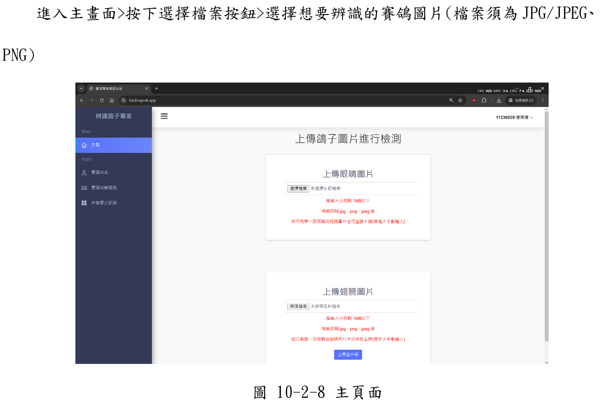
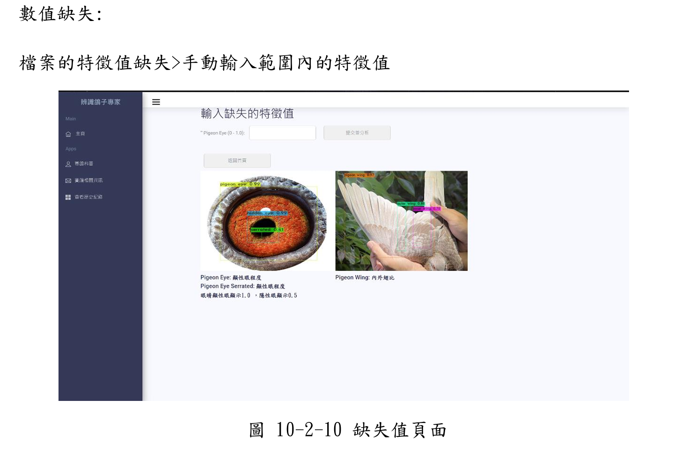
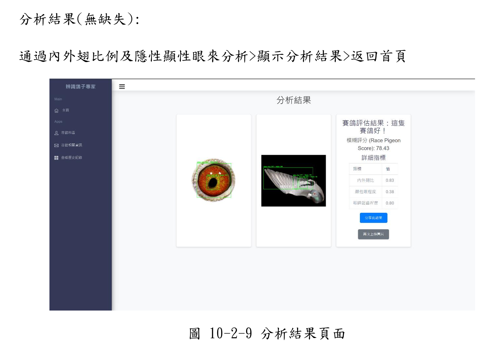
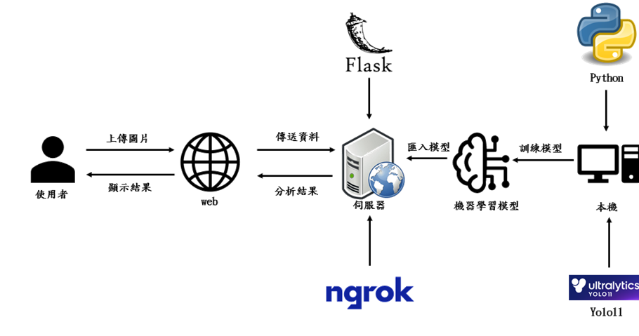
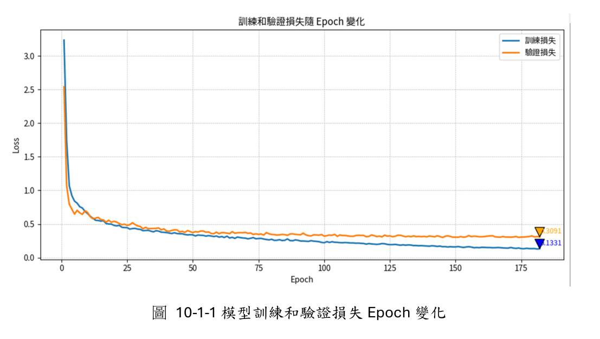
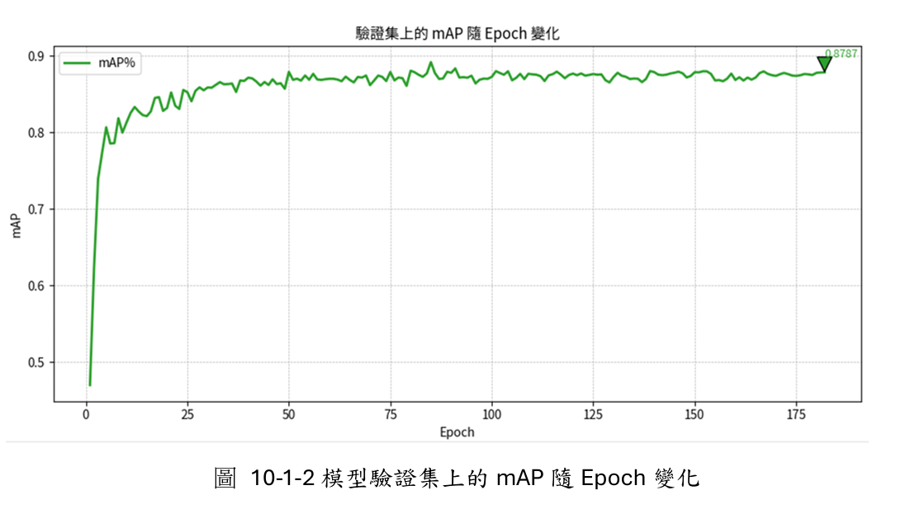
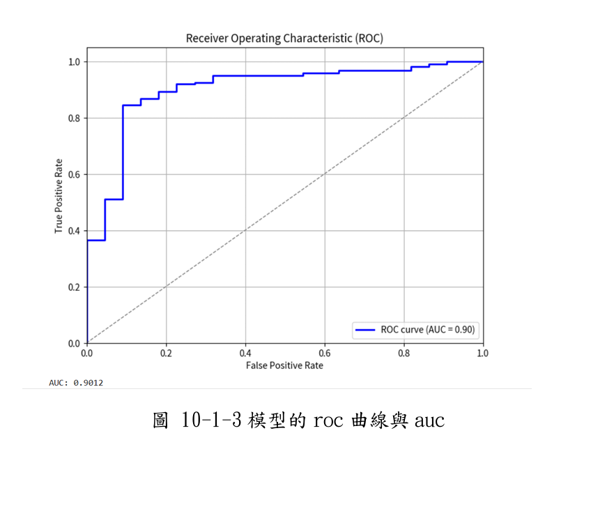

# 🐦 賽鴿專家辨識系統 Race Pigeon Expert System

> 結合 YOLOv11 電腦視覺與模糊專家系統，將傳統賽鴿鑑賞經驗數位化，自動評估賽鴿素質。

---

## 📸 系統展示

> 上傳賽鴿圖片，系統自動分析並輸出綜合素質評分







---

## 📖 專題簡介

傳統賽鴿產業高度依賴專家的感官經驗進行評估，存在**主觀性強、標準不一、技術傳承斷層**等問題。

本系統透過電腦視覺與模糊推理引擎，將抽象的專家經驗量化為具備科學實據的數據模型，實現自動化鑑賞評分。

---

## 🏗️ 系統架構



| 模組 | 說明 |
|------|------|
| 電腦視覺 | YOLOv11 偵測翅膀比例、虹膜特徵 |
| 模糊專家系統 | 將專家知識轉為隸屬函數與規則庫 |
| 後端 API | Flask + SQLite，ngrok 穿透部署 |
| 前端 Web | 上傳圖片、顯示評分結果 |

---

## 🔍 辨識特徵

本系統針對賽鴿以下生理特徵進行數位化分析：

**翅膀分析**
- 內翅（Inner Wing）
- 外翅（Outer Wing）
- 翅膀比例計算

**眼睛分析**
- 主宰眼（Dominant Eye）
- 隱性眼（Hidden Eye）
- 鴿眼（Pigeon Eye）
- 鋸齒狀結構（Serrated）

---

## 📊 模型訓練成果





| 指標 | 數值 |
|------|------|
| 準確率 | **87%** |
| AUC | **0.90** |
| 訓練輪數 | 200 epochs |
| 圖片大小 | 640×640 |
| 模型 | YOLOv11-L |

---

## 🛠️ 技術棧

- **語言**：Python
- **AI 框架**：YOLOv11 (Ultralytics)
- **後端**：Flask、SQLite
- **工具**：Google Colab、ngrok、Fuzzy Logic
- **版本控制**：Git

---

## 📁 專案結構

```
.
├── src/
├── doc/                # 文件
├── assets/                # 圖片、架構圖、結果截圖
└── README.md
```

---

## ✨ 系統亮點

- **非侵入式分析**：僅需上傳圖片，無需接觸鴿子
- **可解釋性 AI（XAI）**：模糊專家系統提供邏輯推導過程，提升可信度
- **跨領域整合**：生物特徵辨識 × 模糊邏輯 × 現代 Web 技術

---

## 📄 授權

本專題僅供學術用途。